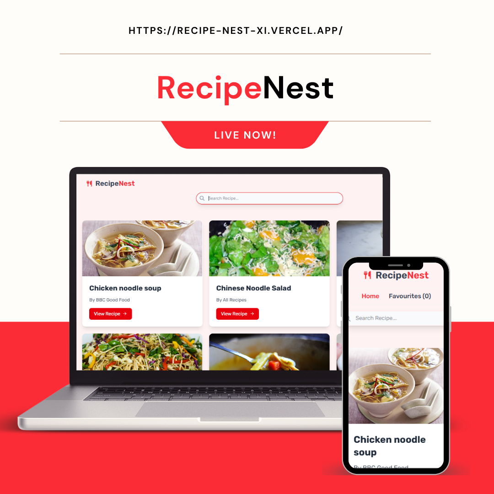

# Recipe Nest

Recipe Nest is a user-friendly web application designed to help food lovers discover, organize, and share their favorite recipes all in one place. Whether you are a beginner cook or a seasoned chef, Recipe Nest makes managing your culinary creations easy and fun.

## 🌐 Live Demo

Explore the live application here: [RecipeNest](https://recipe-nest-xi.vercel.app/)

## Features

- **Browse Recipes:** Explore a wide variety of recipes from different cuisines and categories.
- **Search & Filter:** Quickly find recipes by name, ingredients, or dietary preferences.
- **Favorites:** Save recipes you love for quick access anytime.
- **Responsive Design:** Enjoy a seamless experience on desktop, tablet, and mobile devices.

## Technologies Used

- Frontend: React.js 

- Styling: Tailwind CSS 

## 💡 What I Learned

- How to manage and persist data using **localStorage** to save user preferences and recipes.
- Using React Router hooks like **useNavigate** to programmatically navigate between pages.
- Extracting dynamic route parameters with **useParams** to display specific recipe details.
- Setting up and managing **client-side routing** for a smooth single-page application experience.
- Handling state and side effects in React to update UI based on user interactions.
- Deploying the app live using Vercel for easy sharing and access.

